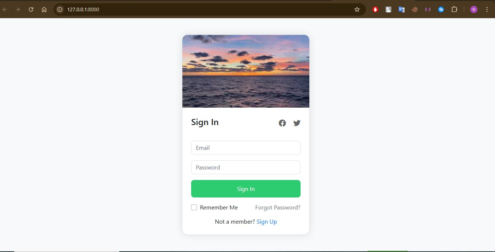
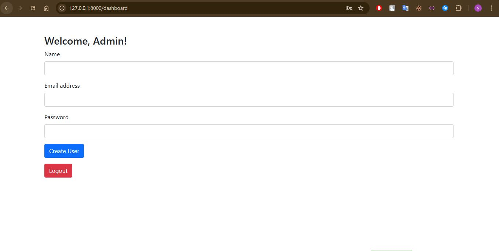

# 🚀 Laravel Coding Interview Project

## Overview

This Laravel-based application demonstrates a robust authentication and user management system with a powerful admin panel. Perfect for showcasing advanced web development skills.

## 🖼 Screenshots

### Login Page



### Dashboard



## 🛠 Tech Stack

-   **Backend:** Laravel (PHP)
-   **Database:** MySQL
-   **Authentication:** Laravel's built-in authentication system
-   **Admin Panel:** Custom administration interface

## 📋 Prerequisites

### System Requirements

-   🐘 PHP 7.4+
-   📦 Composer
-   🗃 MySQL (XAMPP)
-   🌐 Git

## 🚦 Quick Start Guide

### 1. Clone the Repository

```bash
git clone https://github.com/nayan-cse/Coding-Interview.git
cd Coding-Interview
```

### 2. Install Dependencies

```bash
composer install
```

### 3. Environment Configuration

```bash
# Copy environment file
cp .env.example .env

# Generate application key
php artisan key:generate
```

### 4. Database Setup

```bash
# Create database
mysql -e "CREATE DATABASE coding-interview"

# Run migrations
php artisan migrate

# Seed initial data
php artisan db:seed
```

### 5. Launch Application

```bash
php artisan serve
```

🌐 Access the app at: http://127.0.0.1:8000

## 🔐 Authentication Features

-   User registration
-   Login/logout
-   Admin user management
-   Secure authentication system

## 📂 Project Structure

```
/
├── app/             # Core application logic
├── config/          # Configuration files
├── database/        # Migrations and seeders
├── routes/          # Application routes
└── resources/       # Views and frontend assets
```

**Happy Coding!** 💻✨
